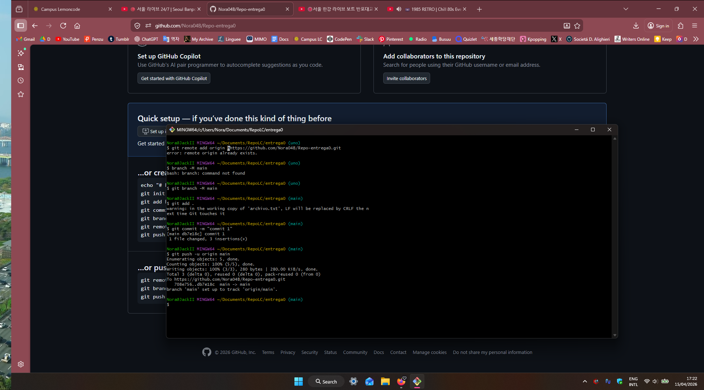
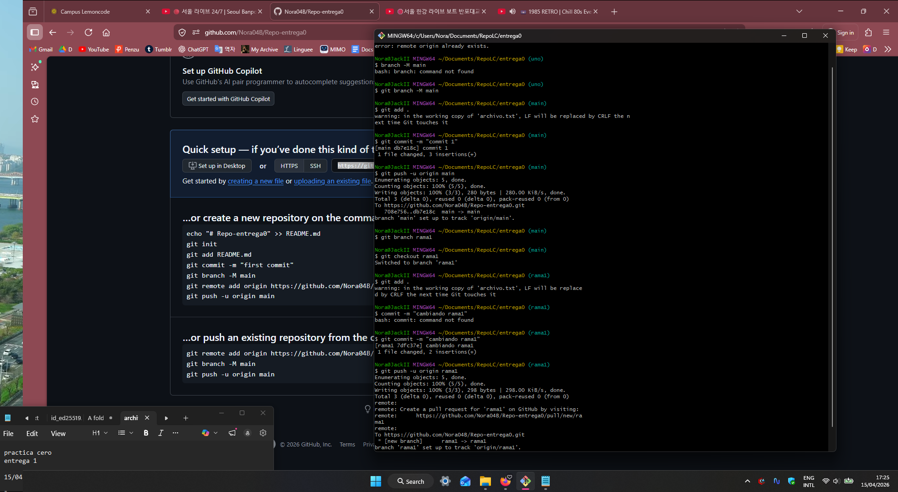

## Entrega 0 Git

Con mkdir creo un repositorio local y con git iniot lo inicalizo
Creo el repositorio en la nube con GitHub y uso git remote add origin y el enlace al repositorio
creo la rama main
Creo un archivo txt y lo modifico, después añado el staging con git add . y hago el commit 'm
Después subo el cambio a github con push -u
Creo una rama llamada rama1, cambio a ella con git checkout
Hago cambios y repito el rpceso de commit y push.
Hago el merge volviendo a la rama main, y usando el comando merge
No hay conflictos, creo el readMe y lo subo a través de bash

---

---
